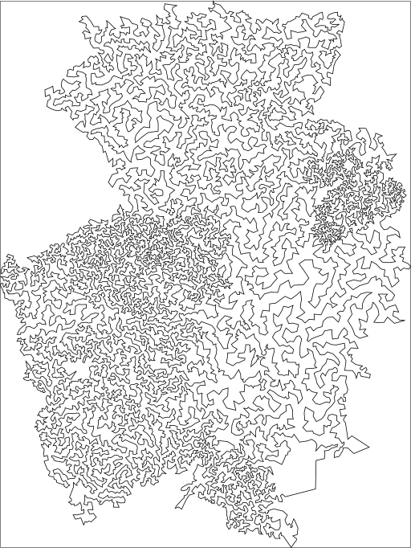

# Focused ACO

A C++ implementation of the Focused Ant Colony Optimization (FACO) for
solving large TSP instances as described in the paper:

    R. Skinderowicz,
    Improving Ant Colony Optimization efficiency for solving large TSP instances,
    Applied Soft Computing, 2022, 108653, ISSN 1568-4946,
    https://doi.org/10.1016/j.asoc.2022.108653

## Compilation

Application requires a C++ compiler with C++17 support, although only GNU g++
in version 9.3.0 has been tested.

To compile enter:

    make

If successful, a new file named `faco` will contain the compiled program.

## Usage

By default only a path to the TSP instance is required, e.g.

    ./faco -p instances/d15112.tsp

This will run the program in parallel using default number of threads which is,
typically, equal to the number of CPU cores x 2.

Sample output:

    Loading TSP instance from file:instances/d15112.tsp
            NAME : d15112
            COMMENT : Deutschland-Problem (A.Rohe)
            TYPE : TSP
            DIMENSION : 15112
            EDGE_WEIGHT_TYPE : EUC_2D
            NODE_COORD_SECTION
            EOF
    nn and backup lists calc time: 1.03635
    Starting execution: 0
    started_at: 2022-02-26T13:00:33.514950024
    initial solutions build time: 0.292985
    initial sol cost: 1.63465e+06
    best sol cost: [64, 1.0s] 1620422 (3.01%)
    best sol cost: [133, 2.0s] 1612069 (2.48%)

    ... omitted for the brevity ...

    best sol cost: [4883, 73.9s] 1580506 (0.47%)
    pher_deposition_time: 3.56592
    sol cost stdev recorded every ith iter: 20
    sol cost mean recorded every ith iter: 20
    mean percent of select next node calls recorded every ith iter: 20
    execution time: 75.9139
    finished_at: 2022-02-26T13:01:49.428943413
    final cost: 1.58046e+06
    final error: 0.468951
    trial time: 75.914
    Route image saved to d15112.svg in 0.0153148 seconds
    trial mean cost: 1.58046e+06
    trial mean error: 0.468951
    trial min cost: 1580461
    trial min error: 0.468951
    trial max cost: 1580461
    trial max error: 0.468951
    Saving results to: results/faco-d15112_2022-02-26--13_01_49.json

* As the last line of the output suggests, the computation logs are written to
  a JSON file created in `results/` subfolder.
* Additionally, a SVG file with visualization of the best (final) route is also
  created in `results/` folder.
* More information about program parameters can be obtained with: `./faco -h`

## Remarks

`best-known.json` contains costs (tour lengths) of the best known solutions for
problems from the TSPLIB repository, and some others. The values were collected
from sources referenced in the paper. In case of a new instance, the
corresponding entry can be easily added to the file so that the program can
print information about relative error of the current best solution.

Solving large TSP instances is very time consuming, so it may be a good idea to
limit the number of ants used and possibly increase the number of iterations, e.g.

    ./faco -p instances/mona-lisa100K.tsp --ants 512 -i 10000
